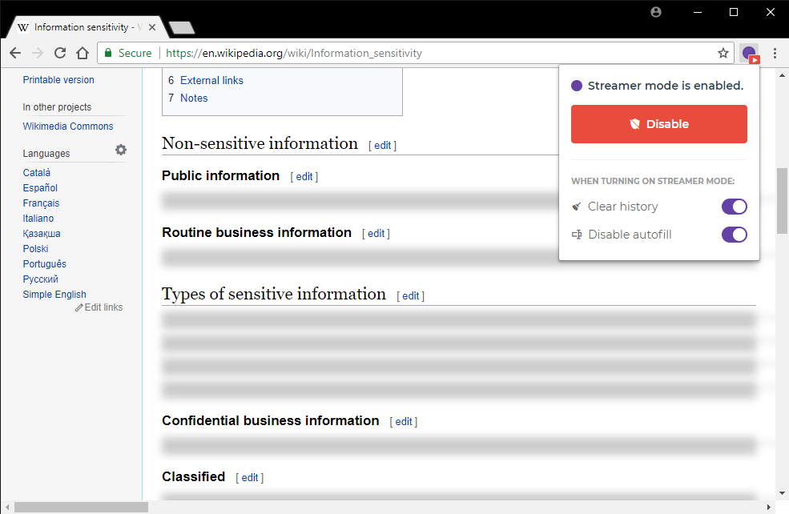

# Streamer Mode for Chrome

***Streamer Mode* is an extension for Google Chrome that can help you censor certain information in the web browser.**

## Features

- Turn streamer mode on or off to **hide sensitive information**.
- Hide any set of elements on any webpage (using CSS selector rules).
- Actually **blanks out censored text** on each page, so it can't be accidentally selected or copied.
- Option to **clear all browser history** when enabling streamer mode.
- Option to **disable form autofill** when enabling streamer mode.

